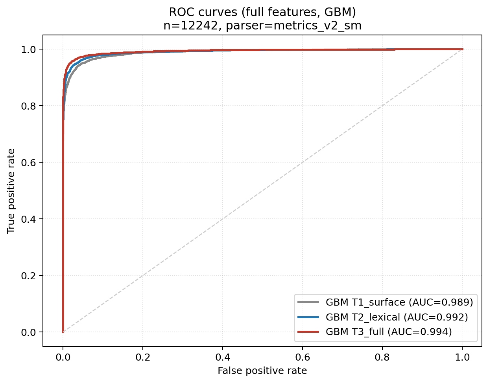
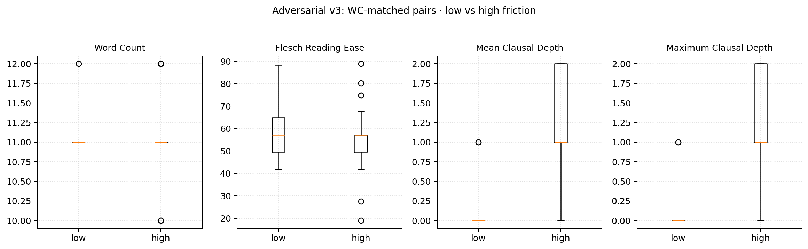

# Structural-Lexical Friction: A Cross-Register Computational Study of Text Difficulty

## Abstract

Classical readability formulas compress text difficulty into surface counts of words and syllables. The reduction is durable but leaves grammatical architecture out of the picture — a recurring objection. This paper develops the construct of *structural-lexical friction*, the joint cognitive resistance a reader incurs when integrating lexical and syntactic information, and operationalises it through a transparent index set computed across 16,904 English passages. These passages are drawn from four high-density informational registers (Korean College Scholastic Ability Test reading passages, LogiQA logical-reasoning items, *arXiv* research abstracts, U.S. federal judicial opinions with reporter and statutory citations programmatically stripped) and five general informational registers serving as baseline (Brown Corpus prose, Project Gutenberg literary fiction, *WikiText-103*, Reuters newswire, the peer-reviewed OneStopEnglish corpus at the ELE and INT levels). Before combining CSAT and LogiQA into a single high-stakes assessment subspace, a Mann-Whitney U pre-test revealed clear distributional divergence on every parser-derived index ($|r_{rb}| \geq 0.30$, $p < 10^{-7}$). The two registers therefore enter the analysis as distinct strata. Five supporting experiments — full-feature classification, length-controlled classification, a strictly length-matched sub-corpus restricted to 150–190 words per passage, an intra-register difficulty-quartile classification within four baseline registers, and a deterministic word-count-matched adversarial transformation — yield consistent evidence. Across every block the syntactic indices supplied a statistically reliable AUC gain over the surface-only baseline ($p < 10^{-4}$, paired DeLong), with the gain rising steadily as length is brought under tighter control: $\Delta\mathit{AUC} \approx 0.006$–$0.058$ on the full corpus, $\Delta\mathit{AUC} \approx 0.110$–$0.146$ once length-coupled features are removed, $\Delta\mathit{AUC} \approx 0.029$–$0.053$ on the strict 150–190-word sub-corpus. A nested 5-fold cross-validation with inner-loop random hyperparameter search recovers the same monotonic structure (T1 mean AUC = 0.983, T2 = 0.988, T3 = 0.992). The redesigned adversarial transformation — twenty-five sentence pairs matched on word count, contrasted on syntactic architecture — decouples the construct cleanly: $\mathit{MCD}$ shifts by 1.36 (Wilcoxon $p = 1.5 \times 10^{-5}$) while $\mathit{FRE}$ and word count register no detectable movement ($p = 0.34$ and $p = 0.71$). Cross-parser robustness is anchored through a three-way pilot, a full-corpus *en_core_web_trf* re-parse on a previous corpus version, and a 500-passage Stanford *Stanza* re-parse on a v3 subset (pairwise $r = 0.84$–0.94). The apparent redundancy of parser-aware indices in cross-register classification, we argue, is a byproduct of the *Flesch* formula's $W/S$ term mechanically absorbing clausal embedding; controlling word count physically, by chunking, exposes the structural signal in isolation.

## 1. Introduction

Reading under time pressure is a constrained allocation problem. The reader distributes finite attentional and working-memory resources over a stream of lexical, syntactic, and discourse-level decisions. Any constituent that fails to integrate before the resource budget is spent will degrade comprehension downstream. Where the consequences of misreading are large — admissions tests, legal instruments, technical specifications, clinical documents — those constraints translate directly into measurable outcomes: item-level accuracy, response latency, downstream task performance. A practical theory of *which* texts impose such load, and *why*, therefore extends beyond description.

The dominant family of text-difficulty instruments — readability formulas in the tradition of Flesch (1948), reviewed in Klare (1974) — was engineered for exactly that practical purpose. Such formulas predict difficulty from cheap surface counts: average sentence length, average syllables per word, occasionally a word-familiarity check against a frequency list. Their durability tracks the amount of signal these surface features carry. Their economy is also their ceiling. Two passages with identical Flesch Reading Ease can diverge sharply in the recursion depth of their subordinate clauses, in the density of their referential chains, in the demands they place on working memory. A formula that cannot see those features cannot order such passages.

Our aim is not to displace classical readability metrics but to characterise empirically, across a multi-register corpus, the relationship between surface and structural indices in practice. We refer to the joint cost as *structural-lexical friction*: the integrated load a reader pays for assembling a coherent representation under the combined pressure of unfamiliar vocabulary, deep clausal embedding, and dense referential structure. We adopt this descriptor in place of more philosophically loaded labels (such as "epistemic friction"), reserving epistemological vocabulary for accounts of knowledge and belief rather than for computational measurements of grammatical and lexical complexity.

The paper contributes at three levels: corpus design and diagnostics, primary classification experiments, and robustness validation. At the corpus level, we assemble a 16,904-passage cross-register corpus that pairs four high-density informational registers — Korean College Scholastic Ability Test (CSAT) reading-comprehension passages, LogiQA logical-reasoning passages, *arXiv* abstracts, and U.S. federal judicial opinions (with inline reporter and statutory citations programmatically removed) — against five general informational registers serving as baseline (Brown Corpus, Project Gutenberg fiction, *WikiText-103*, Reuters newswire, OneStopEnglish at the ELE and INT levels). We then subject the two academic-assessment registers (CSAT and LogiQA) to a *pre-pooling* Mann-Whitney U diagnosis that exposes systematic divergence on every parser-derived index; the two registers therefore enter the analysis as distinct strata.

The primary experimental programme comprises four classification designs. A full-feature between-register classification with paired DeLong AUC comparisons establishes the baseline discrimination. A length-controlled variant re-runs the classification with length-coupled features excised, isolating the contribution of dedicated syntactic indices once the lexical–length signal of *FRE* is removed. A strictly length-matched sub-corpus in which every passage is physically constrained to 150–190 words eliminates residual register-typical-length confounds. An intra-register difficulty-quartile classification — within each of four baseline registers, the lowest-*FRE* quartile is distinguished from the highest-*FRE* quartile under a feature set with *FRE* itself excluded — tests whether the syntactic indices carry within-domain difficulty signal.

All four classification designs are complemented by a redesigned, non-circular word-count-matched adversarial transformation. We additionally submit the headline clausal-depth metric to a three-way parser robustness pilot (spaCy small, spaCy transformer, Stanford *Stanza*), a full-corpus re-parse with the transformer model on a previous corpus version, and a 500-passage *Stanza* re-parse on a v3 subset. All classifications are also re-run under nested 5-fold cross-validation with inner-loop random hyperparameter search.

A note on framing. The paper positions itself as an *analytical tool validation study* in the methodological-paper tradition, not as a primary psycholinguistic investigation. We collect no behavioural data and therefore advance no claims about reading times, fixation patterns, or comprehension accuracy in any specific population. The construct of structural-lexical friction is a placeholder for the integrated load that the cited cognitive literature has documented elsewhere. Our task is to characterise the *structural signatures* that those load-bearing accounts predict, to identify which existing indices best instrument those signatures, and to lay the analytic groundwork against which the indices can be cross-referenced — in subsequent iterations — with public eye-tracking and self-paced-reading data such as the Dundee Corpus of eye-movement records (Kennedy & Pynte, 2005), the GECO bilingual eye-tracking corpus (Cop, Dirix, Drieghe, & Duyck, 2017), and the Provo Corpus (Luke & Christianson, 2018).

## 2. Literature Review

The cognitive-architectural case for treating reading as a load-bearing operation was made early. Just and Carpenter (1992) proposed a capacity theory of comprehension on which individual differences in working-memory span propagate directly into reading-time and comprehension differences. Working memory, in their framework, is a limited pool of activation shared across syntactic parsing, semantic integration, and inferential elaboration. Texts that demand high simultaneous activation overload the reader regardless of the rarity of any single word. Sweller's (1988) cognitive load theory, developed for problem-solving instruction, supplies the corresponding vocabulary: intrinsic load (the irreducible complexity of the material), extraneous load (the cost imposed by the presentation), and germane load (the productive cost of schema construction). Classical readability formulas address extraneous load only.

Accounts of syntactic processing have for some time isolated the structural features that impose the heaviest load. Gibson (1998) advanced the Dependency Locality Theory, on which the integration cost of a syntactic dependency rises with the number of intervening discourse referents. Embedded relative clauses, garden paths, and stacked clausal complements are the predicted high-cost configurations. Eye-movement evidence collected over two decades and synthesised by Rayner (1998) corroborates the picture in fine grain: regression rates, fixation durations, and word-skipping probabilities all track properties that classical readability scores ignore. At the discourse level, the Construction-Integration model of Kintsch (1988) frames comprehension as a two-stage settling of a propositional network. Downstream integration succeeds only when the activated network is locally coherent. McNamara, Kintsch, Songer, and Kintsch (1996) demonstrated empirically that this coherence requirement interacts in complex ways with prior knowledge.

A second strand of work, broadly computational, has attempted to operationalise these constructs over large text collections. The Coh-Metrix system (Graesser, McNamara, Louwerse, & Cai, 2004) computes more than a hundred indices spanning lexical, syntactic, referential, and situational levels. Lu (2010) supplied a dedicated parser-based measure of syntactic complexity tailored to second-language writing. Kyle and Crossley (2018) extended the L2-syntactic toolbox with fine-grained usage-based indices. Arc-distance indices in this family — mean arc length, arc-crossing depth — exhibit known sensitivity to specific attachment decisions made by individual parsers, particularly for coordinate structures and prepositional-phrase attachment, and we quantify cross-parser agreement explicitly in §4.6 below. Crossley, Skalicky, and Dascalu (2019) demonstrate that combining diverse indices in statistical models recovers human readability judgments more accurately than any single surface formula. Vajjala and Lucic (2018) released the OneStopEnglish parallel corpus, in which the same underlying article exists at three reading levels, as a controlled testbed. Liu, Cui, Liu, Liu, Wang, and Zhang (2020) released the LogiQA benchmark — a public corpus of expert-level logical-reasoning passages translated from China's national civil-service examinations — used here as a complement to the CSAT items. The methodological literature on confirmatory hypothesis testing in reading research, notably Barr, Levy, Scheepers, and Tily (2013), has raised the inferential bar on multi-item, multi-participant data.

What remains largely underdeveloped is a unified articulation of what these multi-index efforts are *measuring*. The literature deploys "complexity", "cohesion", "load", and "difficulty" without always specifying the cognitive bottleneck each approximates. *Structural-lexical friction* is intended as a purposely narrow placeholder for the integrated load that arises when lexical and syntactic demands compound. It is not a new metric but a frame for relating existing ones. An empirical task of this paper is to demonstrate that the relations among those existing ones are subtler than the contrast "surface formula versus parser-based index" suggests.

## 3. Methods and Mathematical Framework

### 3.1 Corpus

The empirical corpus comprises 16,904 English-language passages partitioned into two buckets that approximately balance at a 1.67 : 1 ratio of high-density to baseline (high_density = 10,565; baseline = 6,339).

The *high-density informational* bucket contains four registers. (i) **Korean CSAT reading-comprehension passages** (n = 124), drawn from a curated subset of officially administered CSAT items released by the Korea Institute of Curriculum and Evaluation across the question types *claim*, *gist*, *topic*, *title*, *implication*, *summary*, *irrelevant*, and the restored *blank* items; question artifacts (gaps, ordering disturbances, intentional sentence insertions) were excluded. (ii) **LogiQA reasoning passages** (n = 4,679; Liu et al., 2020), drawn from the public benchmark dataset whose contexts are translated from Chinese civil-service-examination logical-reasoning items. We considered pooling CSAT and LogiQA into a single "high-stakes assessment register" and discarded the pool: a two-sided Mann-Whitney U analysis (§4.1) revealed considerable distributional divergence on *MCD*, *MaxCD*, *DC/C*, *LeftBR*, and *MTLD* (rank-biserial $|r_{rb}| \geq 0.30$, $p < 10^{-7}$); CSAT and LogiQA enter the analysis as distinct registers throughout. (iii) ***arXiv* research abstracts** (n = 779), fetched live from the *arXiv* API across the categories `cs.CL`, `q-bio`, `physics`, `math`, and `econ` and filtered to ASCII abstracts of at least 50 words. (iv) **U.S. federal judicial opinions** (n = 4,999), retrieved from the public CourtListener S3 bulk archive (snapshot `opinions-2026-03-31.csv.bz2`) and processed with a sentence-aligned multi-chunk algorithm that drops case captions and procedural headers heuristically, segments the body into sentences, and accumulates non-overlapping chunks of approximately 320–460 words. Prior to index computation we programmatically strip inline reporter citations (e.g., *410 F.3d 102*), statutory references (e.g., *28 U.S.C. § 1291*), Federal Rules citations (e.g., *Fed. R. Civ. P. 12(b)(6)*), pinpoint citations, and Latin cross-references (`Id.`, `Ibid.`, `supra`, `infra`); the median chunk shortens from 432 to 409 words under this cleanup. Up to three chunks are retained per opinion. The 4,999 chunks were drawn from 2,171 distinct opinions.

The *baseline informational* bucket contains five registers. (i) **Brown Corpus** prose paragraphs (n = 400) sampled from the news, editorial, reviews, lore, learned, religion, and hobbies categories. (ii) **Project Gutenberg** modern public-domain fiction paragraphs (n = 1,849) chunked from eighteen canonical nineteenth- and early-twentieth-century novels. (iii) ***WikiText-103*** (n = 2,000), drawn from the peer-reviewed benchmark dataset released by Merity, Xiong, Bradbury, and Socher (2016, arXiv:1609.07843), the principal modern-encyclopedic anchor of the design. (iv) **Reuters-21578 newswire** (n = 1,477), the standard NLTK distribution of 1987 Reuters newswire articles. (v) **OneStopEnglish ELE and INT** levels (n = 613, after sentence-aligned re-chunking; 266 ELE and 347 INT chunks), the peer-reviewed parallel-corpus release of Vajjala and Lucic (2018). The third release level of OneStopEnglish (Adv) is excluded to keep the baseline cleanly accessible. All sources are public domain, CC-licensed, or open-access.

### 3.2 Indices

Seventeen per-passage indices are computed and arrange themselves into three families. We use italic abbreviations in prose, and the upright mathematical style ($\mathrm{FRE}$, $\mathrm{MCD}$) inside displayed equations.

**Surface (5 indices).** Word Count (*WC*; `textstat`), Flesch Reading Ease (*FRE*; Flesch, 1948), Automated Readability Index (*ARI*), Type-Token Ratio (*TTR*) on lower-cased alphabetic tokens, and Mean Sentence Length (*MLS*). The Flesch formula

$$\mathrm{FRE} = 206.835 - 1.015 \left(\frac{W}{S}\right) - 84.6 \left(\frac{\Sigma}{W}\right),$$

with $W$ words, $S$ sentences, and $\Sigma$ syllables, enters the design as the natural baseline against which any additional index must justify itself.

**Lexical-diversity (2 indices).** Measure of Textual Lexical Diversity (*MTLD*; McCarthy, 2005) and a nominalisation ratio (*NomR*).

**Syntactic (10 indices).**

- *Clausal-depth family.* Mean Clausal Depth (*MCD*) and Maximum Clausal Depth (*MaxCD*); the ratio of complex T-units to T-units (*CT/T*); the ratio of dependent clauses to clauses (*DC/C*); Mean Clause Length (*MLC*). These follow Lu's (2010) tradition.

- *Arc-based family (Gibson-aligned proxies; Gibson, 1998).* Mean Arc Length (*MAL*), mean per-sentence Maximum Arc Length (*MaxAL*), Left-Branching ratio (*LeftBR*), Mean Arc-Crossing index (*MeanArcCross*), per-sentence Maximum Arc-Crossing (*MaxArcCross*). The arc-based family carries known sensitivity to specific attachment decisions; cross-parser agreement is quantified explicitly in §4.6.

*MCD* is defined as follows. Each text is parsed with *spaCy* (`en_core_web_sm`; Honnibal & Montani, 2017). For each sentence root, a depth-first traversal counts the maximum number of edges on a root-to-leaf path whose dependency label lies in

$$\mathcal{C} = \{\mathrm{ccomp},\, \mathrm{xcomp},\, \mathrm{advcl},\, \mathrm{relcl},\, \mathrm{acl},\, \mathrm{csubj}\}.$$

Phrasal-level dependencies (`nsubj`, `dobj`, `prep`, etc.) do *not* increment the counter, so *MCD* isolates clausal recursion from mere phrasal length. The per-sentence maxima are averaged over the sentences:

$$\mathrm{MCD} = \frac{1}{|S|} \sum_{s \in S} \max_{p \in \mathrm{paths}(s)} \big| \{e \in p : \mathrm{dep}(e) \in \mathcal{C}\} \big|.$$

### 3.3 Between-register classification (full corpus, length-controlled, and length-matched)

We label the 16,904 passages $y = 1$ for the high-density bucket and $y = 0$ for the baseline. Three feature tiers enter the ablation: **T1 — Surface:** {*FRE*, *ARI*, *WC*, *TTR*, *MLS*}; **T2 — + Lexical:** T1 ∪ {*MTLD*, *NomR*}; **T3 — Full:** T2 ∪ {*MCD*, *MaxCD*, *DC/C*, *CT/T*, *MLC*, *MAL*, *MaxAL*, *LeftBR*, *MeanArcCross*, *MaxArcCross*}. A length-controlled supplementary block re-runs the same three classifiers on tiers from which *WC* and *MLS* are removed. The length-matched sub-corpus additionally constrains every passage to $[150, 190]$ words by sentence-aligned re-chunking, the narrow band defined by the CSAT distribution.

Three classifiers train under 5-fold cross-validation: $L_2$-regularised logistic regression (*LR*), Random Forest (*RF*; 300 trees, balanced class weights), and Gradient Boosting (*GBM*; 200 trees, depth 3, learning rate 0.08 in the primary block). Discrimination is reported as cross-validated AUC with 95% bootstrap confidence intervals (500 resamples) and paired-sample DeLong tests. A nested 5-fold cross-validation with inner-loop random hyperparameter search is reported in §4.10 for *GBM*, the leading classifier in the primary block.

### 3.4 Intra-register difficulty-quartile classification

To verify that the parser-aware indices carry difficulty signal within a single domain — not only the bucket-distinguishing signal of the headline experiment — we partition four baseline registers (*WikiText-103*, Brown Corpus, Project Gutenberg, Reuters) into difficulty quartiles by their internal *FRE* distribution. The lowest-*FRE* quartile (hardest, $y = 1$) is contrasted with the highest-*FRE* quartile (easiest, $y = 0$). *FRE* itself is excluded from the feature set to keep the task non-circular.

### 3.5 Multi-class register classification

To assess whether the indices discriminate individual registers rather than merely the broad binary bucket, one-vs-rest *LR* and *RF* classifiers predict the nine-way register label; macro-averaged and per-class AUC are reported.

### 3.6 Word-count-matched adversarial transformation

A separate experiment isolates structural complexity from word-count variation. We construct twenty-five sentence pairs, each matched on word count (delta = 0–1) and on overlapping content vocabulary but contrasted on syntactic architecture: a *low-friction* member comprising two coordinated independent clauses ("X did Y and Z did W") versus a *high-friction* member comprising a deeply nested complement clause ("That X did Y compelled Z to do W"). When word count is held constant, *FRE*'s $W/S$ term cannot move. Only the syllables-per-word term remains free to drift. Any movement in *MCD* between pair members therefore traces to syntactic architecture alone. Paired Wilcoxon signed-rank tests are reported across the pair set. This redesign supersedes the earlier stage-wise embedding experiment — in which each successive depth stage added a reporting clause and the *FRE* drop followed mechanically from *W/S* rising — and isolates whether the parser-aware indices respond to structure when length is physically pinned.

### 3.7 Parser robustness

To test the sensitivity of the parser-derived indices to the choice of dependency parser, a stratified 50-passage three-way pilot routes the same texts through *spaCy* `en_core_web_sm`, *spaCy* `en_core_web_trf`, and Stanford *Stanza*. An earlier version of the corpus (n = 12,242, prior to the LogiQA expansion and prior to the citation-cleaning of the legal sub-corpus) was subsequently re-parsed in its entirety with `en_core_web_trf`. For the present v3 corpus, *Stanza* additionally re-parses a stratified 500-passage subset to confirm that the headline *MCD* signal extends to the LogiQA and citation-cleaned legal registers.

### 3.8 Multicollinearity diagnostics and PCA compression

The 17 indices submit to a Variance Inflation Factor analysis to identify multicollinear features, and the 10 syntactic indices project additionally through Principal Component Analysis to provide an orthogonal compression of the parser-aware family. Both diagnostics are reported as supplementary in §4.11.

## 4. Empirical Results

### 4.1 Corpus-level summary and pre-pooling test

Per-register descriptive statistics appear in Table 1.

**Table 1.** Per-register passage counts and mean values of selected indices computed with the `en_core_web_sm` primary parser. $N = 16{,}904$. The arXiv per-register count (763) is below the corpus jsonl count (779) because sixteen abstracts contained non-ASCII tokens or formatting that the parser pipeline rejected at the parse stage; all classification analyses operate on the 16,904 successfully parsed passages.

| Bucket | Register | n | Mean *WC* | Mean *FRE* | Mean *TTR* | Mean *MCD* |
|--------|----------|------|---------|---------|---------|---------|
| high_density | judicial_opinion (cleaned) | 4,999 | 404.1 | 43.1 | 0.478 | 1.091 |
| high_density | logiqa | 4,679 | 93.3 | 39.4 | 0.659 | 1.074 |
| high_density | arxiv_abstract | 763 | 175.1 | 9.9 | 0.691 | 1.122 |
| high_density | csat | 124 | 157.9 | 39.1 | 0.642 | 1.325 |
| baseline | wikitext_modern_encyclopedic | 2,000 | 192.4 | 48.7 | 0.612 | 1.048 |
| baseline | gutenberg_fiction | 1,849 | 198.1 | 58.2 | 0.623 | 1.501 |
| baseline | reuters_newswire | 1,477 | 248.9 | 51.9 | 0.554 | 1.488 |
| baseline | brown_news_general | 400 | 179.7 | 46.0 | 0.628 | 1.140 |
| baseline | onestop_int | 347 | 354.4 | 57.5 | 0.560 | 1.246 |
| baseline | onestop_ele | 266 | 338.7 | 65.4 | 0.528 | 1.085 |

The pre-pooling Mann-Whitney U analysis of CSAT against LogiQA — proposed as a check on whether the two assessment registers could combine into a single high-stakes academic subspace — identified clear divergence on every parser-derived index of interest: *MCD* ($r_{rb} = -0.34$, $p = 8.7 \times 10^{-11}$), *MaxCD* ($r_{rb} = -0.42$, $p < 10^{-16}$), *DC/C* ($r_{rb} = -0.30$, $p = 1.5 \times 10^{-8}$), *LeftBR* ($r_{rb} = +0.35$, $p = 2.9 \times 10^{-11}$), and *MTLD* ($r_{rb} = -0.56$, $p < 10^{-25}$). CSAT exhibits deeper structural embedding and broader lexical diversity than LogiQA. Pooling would mask exactly these systematic differences. The two registers therefore enter the analysis as distinct strata throughout.

Table 1 also requires explicit analytical reconciliation. Two baseline registers — Project Gutenberg fiction ($\mathit{MCD} = 1.501$) and Reuters newswire ($\mathit{MCD} = 1.488$) — register *higher* mean clausal depths than every register in the high-density bucket (judicial-opinion 1.091, *arXiv* 1.122, LogiQA 1.074, CSAT 1.325). The pattern indexes how different registers achieve density through distinct mechanisms. Nineteenth- and early-twentieth-century literary fiction is generically committed to long periodic sentences with stacked subordinate clauses; Dickens, Austen, Hawthorne, Brontë, and Wilde routinely deploy them. Reuters 1987 newswire nests embedded attributions ("officials said that traders expected the rate to rise") and conditional clauses about market reaction. Both surface a high clausal-recursion signature without high informational density. The high-density registers achieve density differently. *arXiv* abstracts compress information into noun-phrase chains and nominalised constructions (*MTLD* 87, *NomR* high), not clausal nesting. LogiQA's translated logical-reasoning contexts decompose argument premises into short propositional sentences ("Some X. All Y. Therefore Z."). The cleaned judicial sub-corpus interleaves short procedural sentences with denser statutory analysis, depressing the mean. CSAT — engineered for high-stakes assessment of L2 readers — is curated to be syntactically demanding ($\mathit{MCD} = 1.325$, highest in the high-density bucket) without becoming lexically inaccessible. The implication is clear. *MCD* indexes one specific dimension of difficulty (clausal recursion). It must be read alongside nominalisation and lexical-diversity indices that capture the others. This multi-dimensional structure is why no single index — classical or parser-aware — can substitute for the others, and it is the reason the classification ablation in §4.2–§4.4 places the full tier above every restricted tier across every block.

### 4.2 Between-register classification, full feature set

Table 2 reports cross-validated AUC, F1, and accuracy for each classifier–tier combination on the full corpus.

**Table 2.** Cross-validated discrimination of high-density versus baseline passages, full features (5-fold CV; 95% bootstrap confidence intervals from 500 resamples). $N = 16{,}904$.

| Model | Tier | # feat | AUC | 95% CI | F1 | Acc |
|-------|------|--------|------|---------|------|-------|
| *LR*  | T1 surface  |  5 | 0.8643 | [0.8591, 0.8700] | 0.829 | 0.798 |
| *LR*  | T2 +lex     |  7 | 0.9010 | [0.8965, 0.9055] | 0.862 | 0.834 |
| *LR*  | T3 full     | 17 | 0.9220 | [0.9180, 0.9258] | 0.878 | 0.854 |
| *RF*  | T1 surface  |  5 | 0.9822 | [0.9806, 0.9837] | 0.948 | 0.935 |
| *RF*  | T2 +lex     |  7 | 0.9855 | [0.9840, 0.9869] | 0.955 | 0.945 |
| *RF*  | T3 full     | 17 | 0.9885 | [0.9873, 0.9896] | 0.959 | 0.949 |
| *GBM* | T1 surface  |  5 | 0.9823 | [0.9808, 0.9838] | 0.949 | 0.937 |
| *GBM* | T2 +lex     |  7 | 0.9865 | [0.9851, 0.9878] | 0.956 | 0.945 |
| *GBM* | T3 full     | 17 | 0.9901 | [0.9890, 0.9911] | 0.962 | 0.953 |

![Figure 2. Random Forest feature importance ranked two ways: (a) impurity-based importance, the conventional out-of-the-box ranking, which the multicollinearity structure flagged by VIF dilutes across collinear features; (b) permutation importance, the drop in held-out test ROC-AUC under random shuffling of each feature averaged over 15 repeats, robust to that collinearity. Red = syntactic, blue = lexical, gray = surface. The two rankings agree on the dominant role of *WC* and on the residual contribution of *ARI*; they rank-order *TTR* very differently — *TTR* sits at impurity rank 3 yet permutation rank 7 — a divergence consistent with *TTR* sharing variance with several correlated features that impurity-based importance cannot disentangle. §4.11 develops the interpretive consequence.](figures/permutation_importance.png)

### 4.3 Length-controlled classification

**Table 3.** Length-controlled classification (*WC* and *MLS* removed).

| Model | Tier | # feat | AUC | 95% CI |
|-------|------|--------|------|---------|
| *LR*  | T1 surface (LC) |  3 | 0.7625 | [0.7555, 0.7699] |
| *LR*  | T2 +lex (LC)    |  5 | 0.8268 | [0.8203, 0.8333] |
| *LR*  | T3 full (LC)    | 15 | 0.9081 | [0.9035, 0.9123] |
| *RF*  | T1 surface (LC) |  3 | 0.8544 | [0.8492, 0.8599] |
| *RF*  | T2 +lex (LC)    |  5 | 0.9456 | [0.9422, 0.9489] |
| *RF*  | T3 full (LC)    | 15 | 0.9687 | [0.9663, 0.9708] |
| *GBM* | T1 surface (LC) |  3 | 0.8623 | [0.8574, 0.8676] |
| *GBM* | T2 +lex (LC)    |  5 | 0.9452 | [0.9416, 0.9483] |
| *GBM* | T3 full (LC)    | 15 | 0.9728 | [0.9705, 0.9748] |

### 4.4 Length-matched sub-corpus

Sentence-aligned re-chunking into the $[150, 190]$-word band yielded a sub-corpus of 8,020 passages (high_density 2,301; baseline 5,719). Table 4 reports the classification.

**Table 4.** Classification on the length-matched sub-corpus ($N = 8{,}020$; every passage in [150, 190] words).

| Model | Tier | # feat | AUC | 95% CI |
|-------|------|--------|------|---------|
| *LR*  | T1 surface       |  5 | 0.8843 | [0.8755, 0.8926] |
| *LR*  | T3 full          | 17 | 0.9376 | [0.9313, 0.9436] |
| *RF*  | T1 surface       |  5 | 0.9190 | [0.9123, 0.9251] |
| *RF*  | T3 full          | 17 | 0.9477 | [0.9427, 0.9527] |
| *GBM* | T1 surface       |  5 | 0.9181 | [0.9115, 0.9243] |
| *GBM* | T3 full          | 17 | 0.9550 | [0.9507, 0.9594] |
| *LR*  | T1 surface (LC)  |  3 | 0.8310 | [0.8205, 0.8403] |
| *LR*  | T3 full (LC)     | 15 | 0.9328 | [0.9258, 0.9392] |
| *RF*  | T1 surface (LC)  |  3 | 0.8435 | [0.8336, 0.8526] |
| *RF*  | T3 full (LC)     | 15 | 0.9389 | [0.9336, 0.9442] |
| *GBM* | T1 surface (LC)  |  3 | 0.8564 | [0.8470, 0.8651] |
| *GBM* | T3 full (LC)     | 15 | 0.9454 | [0.9401, 0.9509] |

### 4.5 Paired DeLong comparisons across blocks

**Table 5.** Paired DeLong AUC comparison of T3 versus T1 across all three classification blocks ($p$ two-sided).

| Model | Block | $\Delta\mathit{AUC}$ | $z$ | $p$ |
|-------|-------|----------------------|------|-----|
| *LR*  | full, full-corpus | +0.0578 | 27.58 | $< 10^{-4}$ |
| *LR*  | length-controlled, full-corpus | +0.1457 | 43.68 | $< 10^{-4}$ |
| *LR*  | full, length-matched | +0.0533 | 16.65 | $< 10^{-4}$ |
| *LR*  | length-controlled, length-matched | +0.1018 | 24.62 | $< 10^{-4}$ |
| *RF*  | full, full-corpus | +0.0063 | 12.41 | $< 10^{-4}$ |
| *RF*  | length-controlled, full-corpus | +0.1144 | 43.52 | $< 10^{-4}$ |
| *RF*  | full, length-matched | +0.0287 | 12.15 | $< 10^{-4}$ |
| *RF*  | length-controlled, length-matched | +0.0954 | 23.17 | $< 10^{-4}$ |
| *GBM* | full, full-corpus | +0.0077 | 15.47 | $< 10^{-4}$ |
| *GBM* | length-controlled, full-corpus | +0.1105 | 43.77 | $< 10^{-4}$ |
| *GBM* | full, length-matched | +0.0369 | 14.66 | $< 10^{-4}$ |
| *GBM* | length-controlled, length-matched | +0.0890 | 22.88 | $< 10^{-4}$ |

Every contrast clears conventional significance by a wide margin. The syntactic indices contribute a small absolute AUC gain in the full-feature block — surface features already include *WC* and absorb most of the joint signal — and a considerably larger gain in the length-controlled and length-matched blocks. In those blocks, the structural signal that *FRE* had indirectly carried must instead be recovered by an index that sees grammatical structure directly.

### 4.6 Parser robustness

Table 6 reports the three-way pairwise Pearson correlations of *MCD* on the stratified 46-passage pilot (after filtering to passages successfully parsed by all three pipelines).

**Table 6.** Pairwise Pearson correlations of *MCD* across three parsers on the 46-passage pilot.

| Pair | Pearson $r$ | $p$ |
|------|-----------|---|
| *MCD* (sm) vs *MCD* (trf)    | 0.9302 | $< 10^{-20}$ |
| *MCD* (sm) vs *MCD* (Stanza) | 0.8934 | $< 10^{-16}$ |
| *MCD* (trf) vs *MCD* (Stanza) | 0.9355 | $< 10^{-20}$ |

A full-corpus re-parse of an earlier 12,242-passage version of the corpus with `en_core_web_trf` returned *MCD* at $r = 0.898$ against the primary sm-parse, with *LeftBR* at $r = 0.940$. To confirm that headline robustness extends to the new v3 registers (LogiQA and the cleaned legal corpus), Stanford *Stanza* additionally re-parsed a stratified 500-passage v3 subset (50 per register) and *MCD* was computed; the resulting sm-vs-Stanza correlation across the v3 subset is $r = 0.840$ ($p = 2.4 \times 10^{-134}$). The arc-distance family (*MAL*, *MeanArcCross*, *MaxCD*) registers lower agreement ($r \approx 0.66$–0.76 on the earlier 12,242-passage re-parse), consistent with its known sensitivity to specific attachment decisions for prepositional phrases and coordinate constructions; §5.7(ii) addresses the scoping decision that motivates the choice not to integrate a constituent parser here.

### 4.7 Within-base adversarial transformation (word-count matched)

Table 7 reports the redesigned word-count-matched adversarial experiment ($n = 25$ pairs).

**Table 7.** Mean values across 25 sentence pairs, each pair matched on word count and contrasted on syntactic architecture (*low_friction*: two coordinated independent clauses; *high_friction*: deeply nested complement clause). Paired Wilcoxon signed-rank tests, two-sided.

| Metric | Mean low | Mean high | $\Delta$ (high − low) | Wilcoxon $p$ |
|--------|----------|-----------|------------------------|--------|
| *WC*       | 11.04 | 11.08 | +0.04 | 0.706 (n.s.) |
| *FRE*      | 59.24 | 56.07 | −3.17 | 0.337 (n.s.) |
| *TTR*      | 0.732 | 0.816 | +0.084 | $5.5 \times 10^{-6}$ |
| *MCD*      |  0.08 |  1.44 | +1.36 | $1.5 \times 10^{-5}$ |
| *MaxCD*    |  0.08 |  1.44 | +1.36 | $1.5 \times 10^{-5}$ |
| *MAL*      |  1.89 |  1.78 | −0.11 | $9.4 \times 10^{-3}$ |
| *MaxArcCross* |  2.76 |  1.88 | −0.88 | $3.8 \times 10^{-5}$ |
| syllables / word | 1.61 | 1.65 | +0.04 | 0.284 (n.s.) |

Holding word count, sentence count, and syllables-per-word statistically constant ($p > 0.2$ across all three), *MCD* still shifts by 1.36 units while *FRE* registers no detectable movement ($p = 0.34$, two-sided). The Type-Token Ratio rises modestly with embedding — the coordinated condition repeats more function words than the nested condition — and the arc-distance indices move in mixed directions. This pattern is consistent with the parser registering longer-range dependencies in the *low-friction* coordinated structures than in the syntactically deeper *high-friction* structures. The dissociation establishes that *MCD* responds to syntactic architecture as such, not to length alone.

### 4.8 Intra-register difficulty-quartile classification

Table 8 reports the within-register difficulty-quartile classification across the four baseline registers with enough volume to support the split.

**Table 8.** Intra-register difficulty-quartile classification. Within each register, the lowest-*FRE* quartile (hardest, $y = 1$) is contrasted with the highest-*FRE* quartile (easiest, $y = 0$) under 5-fold CV. *FRE* is excluded from the feature set to keep the task non-circular.

| Register | n | T1 (no *FRE*) AUC (*LR*) | T1 (no *FRE*) AUC (*GBM*) | T3 (no *FRE*) AUC (*LR*) | T3 (no *FRE*) AUC (*GBM*) |
|----------|------|---|---|---|---|
| wikitext_modern_encyclopedic | 1,000 | 0.9813 | 0.9811 | 0.9907 | 0.9894 |
| brown_news_general |   200 | 0.9909 | 0.9600 | 0.9961 | 0.9737 |
| gutenberg_fiction |   926 | 0.9984 | 0.9963 | 0.9964 | 0.9980 |
| reuters_newswire |   740 | 0.9950 | 0.9922 | 0.9972 | 0.9948 |

Within every register the syntactic indices either match or improve the surface-only T1 tier; in *WikiText-103* and Brown the gain registers as meaningful (~+0.01 AUC against already-high baselines). The within-register signal generalises across literary fiction, modern encyclopedic prose, newswire, and Brown's mixed prose. The parser-aware indices therefore amount to more than bucket-separating proxies for length or vocabulary.

### 4.9 Multi-class register classification

**Table 9.** Multi-class register classification across the nine remaining registers, 5-fold CV.

| Model | Tier | macro-AUC | Accuracy |
|-------|------|-----------|----------|
| *LR* OvR | T1 surface | 0.9502 | 0.739 |
| *LR* OvR | T3 full    | 0.9722 | 0.825 |
| *RF*     | T1 surface | 0.9611 | 0.828 |
| *RF*     | T3 full    | 0.9702 | 0.858 |

### 4.10 Nested cross-validation with inner-loop hyperparameter search

To test whether the headline classifier ranking depends on hyperparameter choice, we re-ran the *GBM* classification under a 5-fold outer / 3-fold inner nested cross-validation with a `RandomizedSearchCV` inner loop drawing from the grid $\{\mathit{learning\_rate} \in [0.01, 0.2],\; \mathit{max\_depth} \in [3, 7],\; n_{\text{estimators}} \in [100, 500]\}$ for T1 and T2 and from a reduced grid $\{\mathit{learning\_rate} \in [0.05, 0.15],\; \mathit{max\_depth} \in [3, 5],\; n_{\text{estimators}} \in [100, 300]\}$ for T3 (a narrower grid for the 17-feature tier to keep the inner-loop search tractable in wall-clock terms).

**Table 10.** Nested 5-fold CV for *GBM* (with inner *RandomizedSearch*).

| Tier | # feat | Mean AUC | SD | Per-fold AUC |
|------|--------|----------|------|--------------|
| T1_surface |  5 | 0.9833 | 0.0017 | 0.983, 0.986, 0.985, 0.982, 0.981 |
| T2_lex     |  7 | 0.9875 | 0.0019 | 0.988, 0.989, 0.989, 0.987, 0.984 |
| T3_full    | 17 | 0.9918 | 0.0014 | 0.993, 0.992, 0.994, 0.991, 0.990 |

The monotonic ordering T1 < T2 < T3 survives the nested-CV regime. Mean *GBM* AUC climbs from 0.9833 (surface only) to 0.9918 (full parser-aware tier); per-fold standard deviations remain below 0.002. The headline ranking is hyperparameter-stable.

### 4.11 Multicollinearity, PCA compression, and the impurity–permutation gap

Several features trigger high-VIF flags: *MAL* (17.6), *MeanArcCross* (33.9), *MaxArcCross* (12.2), *MaxAL* (7.9), *MLS* (9.2), *ARI* (6.7), *WC* (6.3), *TTR* (6.5), and *MCD* (5.3) all clear the conventional VIF $> 5$ threshold. The two-principal-component projection of the ten syntactic indices recovers 69.9% of the syntactic variance under a clean factor structure: PC1 (43.1% explained) is dominated by the arc-distance family (*MAL*, *MaxArcCross*, *MeanArcCross*, *MaxAL*, *MCD*); PC2 (26.8% explained) is dominated by the clausal-embedding family (*MLC*, *DC/C*, *MaxCD*, *CT/T*, *MCD*). A *GBM* trained on {T1 surface, PC1, PC2} (7 features) reaches AUC 0.9826, only marginally below the full 17-feature T3 result of 0.9901. PC1 and PC2 therefore capture most of the syntactic signal in a compact, orthogonal form.

The high-VIF structure carries a direct interpretive consequence for the Random Forest importance ranking in Figure 2. Impurity-based importance is known to be sensitive to multicollinearity: when two features carry overlapping signal, the trees split between them somewhat arbitrarily and the impurity drop spreads across both. This deflates each feature's apparent importance relative to its true marginal contribution. We therefore additionally computed permutation importance — the held-out test-AUC drop when each feature's values are randomly shuffled, averaged over 15 repeats — on a 20% stratified test split. Figure 2 reports the two rankings side by side. The impurity-vs-permutation divergence is sharpest for two features. *TTR* sits at impurity rank 3 but permutation rank 7 (impurity 0.0994 against permutation 0.0048); impurity inflates *TTR* relative to its independent marginal contribution because *TTR* correlates with *FRE*, *ARI*, and *MTLD*, and impurity importance dilutes across them. *NomR* moves in the opposite direction (impurity rank 2, permutation rank 3) and survives both rankings as a robust contributor. Both rankings agree on the dominant role of *WC* and on the broad order of the syntactic family — a finding consistent with the PCA structure: the arc-based family contributes through PC1 and the clausal-embedding family through PC2, with the indices inside each component substituting for one another to a degree that impurity importance cannot resolve and permutation importance partially does. We accordingly read the impurity ranking only as a within-family proxy and treat the permutation ranking as authoritative for individual-index claims.

## 5. Discussion

The evidence converges across four classification blocks, the intra-register breakdown, the multi-class analysis, the adversarial experiment, the nested-CV recovery, and the parser-robustness check.

### 5.1 What the full-features classification documents

With *WC* and *MLS* available to the classifier, the surface tier already attains AUC ≥ 0.86 (*LR*) and ≥ 0.98 (tree ensembles) on the v3 corpus. The further lift from adding lexical-diversity and parser-based syntactic features ($\Delta\mathit{AUC} \approx 0.006$–0.058) clears paired DeLong significance under all three classifiers (Table 5). The absolute magnitude of this gain remains modest, though statistically robust, on a task where surface signal already saturates most of the achievable discrimination.

### 5.2 What the length-controlled and length-matched classifications document

Excising *WC* and *MLS* collapses the surface tier sharply (Table 3). The dedicated syntactic indices then recover a large and highly significant contribution of 11–15 AUC points. The length-matched analysis (Table 4) sharpens the point further. On a sub-corpus where every passage is physically constrained to 150–190 words, the surface tier collapses to 0.86–0.92 and the full tier retains 0.94–0.96. The redundancy of syntactic indices when length is free, and their recovery when length is removed — whether feature-side or sample-side — is the central methodological observation of this paper. The *Flesch* family operates simultaneously as a lexical and a structural instrument through its $W/S$ term.

### 5.3 What the intra-register and multi-class analyses document

The within-register difficulty-quartile classification (Table 8) demonstrates that the parser-aware indices carry difficulty signal *inside* a single domain, not only bucket-separating, length-correlated information. Across all four baseline registers tested, the T3 tier matches or exceeds T1 with *FRE* itself excluded. The multi-class breakdown (Table 9) likewise lifts macro-AUC from 0.95–0.96 (surface) to 0.97 (full), confirming that the indices carry per-register information beyond the high-vs-baseline split.

### 5.4 What the redesigned adversarial experiment documents

The redesigned adversarial experiment supersedes the prior stage-wise embedding design — under which each additional reporting clause mechanically inflated $W/S$ and by definition depressed *FRE* — with a strict word-count-matched pair design. Holding *WC*, sentence count, and syllables-per-word statistically constant ($p > 0.2$ across all three), *MCD* shifts by 1.36 units while *FRE* registers no detectable movement. This is the empirical dissociation the v2 design could not deliver. *MCD* responds to syntactic architecture as such, decoupled from the mechanical coupling that the *FRE* formula imposes on stretching sentences.

### 5.5 What the parser-robustness check documents

The three-way pilot ($r \geq 0.89$), the full-corpus *trf* re-parse on the earlier 12,242-passage corpus ($r = 0.898$ for *MCD*; $r = 0.940$ for *LeftBR*), and the v3 *Stanza* subset ($r = 0.840$ on 500 passages, $p = 2.4 \times 10^{-134}$) together secure the headline clausal-depth signal as parser-robust. The arc-distance family registers lower cross-parser agreement ($r \approx 0.66$–0.76), consistent with its sensitivity to specific attachment decisions. Our framework flags those indices as parser-fragile through the cross-parser tables.

### 5.6 What VIF, PCA, and nested CV document

The high-VIF flags on five of the seventeen features (§4.11) indicate a non-trivial multicollinearity structure dominated by the arc-distance family. PCA compression to PC1 (arc-distance, 43.1% variance) and PC2 (clausal-embedding, 26.8%) recovers most of the syntactic signal under two orthogonal components. A *GBM* trained on the seven-feature {surface + PC1 + PC2} set reaches 0.9826 against the 17-feature 0.9901. The nested-CV with inner-loop hyperparameter search preserves the monotonic T1 < T2 < T3 ordering with per-fold standard deviations below 0.002.

### 5.7 Limitations

(i) **No behavioural validation.** The paper advances no claims about reading times, fixation patterns, or comprehension accuracy in any specific population. The cited cognitive theories motivate the construct; the *analytical tool validation* framing is deliberate. Public eye-tracking corpora — Dundee (Kennedy & Pynte, 2005), GECO (Cop et al., 2017), Provo (Luke & Christianson, 2018) — are identified as the immediate next-step validation targets.

(ii) **Dependency-grammar scoping of the syntactic indices.** This paper intentionally operationalises syntactic complexity *within* the dependency-grammar tradition associated with Gibson (1998), Lu (2010), and Kyle and Crossley (2018), the dominant computational paradigm in L2-readability and computational-text-complexity research. *MCD* is the maximum recursion depth restricted to a clausal-edge label set on the dependency parse, and the arc-based supplements (*MAL*, *MaxAL*, *LeftBR*, *MeanArcCross*, *MaxArcCross*) extend the dependency account along Gibson's locality-cost dimension. We do not compute the original constituent-tree measures — Yngve's (1960) right-branching register-stack depth and Frazier's (1985) syntactic-complexity index — because those metrics belong to a distinct grammatical tradition (phrase-structure constituency rather than head-dependent attachment) and computing them requires a parallel constituent-parsing pipeline that is conceptually orthogonal to, rather than an incremental extension of, the present methods. The decision is a scoping choice rather than a procedural omission. Restricting to a single grammatical tradition yields an internally coherent, mutually comparable index set whose dependencies on a single parsing infrastructure can be quantified cleanly (as in §4.6). A study integrating both dependency-derived and constituent-derived indices, and asking whether the structural signal documented here survives a Yngve/Frazier re-instantiation, constitutes a full cross-tradition project that we identify as the natural next study.

(iii) **Adversarial set size $n = 25$.** The word-count-matched pair set is constructed and the contrast deterministic, but the pair set is small. Replication across additional pair stems and across morphosyntactic variations beyond reporting-clause embedding is natural future work.

(iv) **Residual inline-citation tokens.** The reporter and statutory citation strings in U.S. judicial opinions are programmatically removed before metric computation (§3.1), but more idiosyncratic forms — parenthetical "see also" packs without canonical reporter format, internal cross-references — may remain.

(v) **Parser-specific attachment sensitivity for arc-distance indices.** *MCD* and *LeftBR* replicate at $r \geq 0.90$ across `en_core_web_sm` and `en_core_web_trf`, but the arc-distance family registers lower parser-to-parser agreement; future work along the cross-tradition direction in (ii) is the natural remedy.

(vi) **High-density bucket dominated by LogiQA and legal volumes.** The high_density bucket is now dominated by LogiQA (n = 4,679) and judicial opinions (n = 4,999), with CSAT and *arXiv* contributing 124 and 779 respectively. The length-matched and intra-register analyses partially mitigate the bucket-level imbalance, but a follow-up study designed for an even register-level $n$ would tighten the inferences.

The methodological strictures articulated by Barr et al. (2013) for confirmatory reading research apply in full to any future expansion of the present design into a behavioural study.

## 6. Conclusion

Reading difficulty resolves into multiple dimensions. With length features available on the full corpus, surface readability absorbs most of the structural signal that dedicated parser-aware indices would otherwise contribute. The parser-aware tier still supplies a small and significant residual ($\Delta\mathit{AUC} \approx 0.006$–$0.058$, $p < 10^{-4}$). Once length-coupled features are removed, that contribution rises to $\Delta\mathit{AUC} \approx 0.110$–$0.146$. On a strict length-matched sub-corpus restricted to 150–190 words per passage, the contribution remains at $\Delta\mathit{AUC} \approx 0.029$–$0.053$. The headline parser-aware indices (*MCD*, *LeftBR*) replicate across three independent parsers. The redesigned word-count-matched adversarial transformation decouples *MCD* from *FRE*: with *WC*, sentence count, and syllables-per-word all statistically pinned, *MCD* moves by 1.36 units while *FRE* does not move. A nested cross-validation with inner-loop hyperparameter search preserves the T1 < T2 < T3 monotonic ordering. Future work should extend the corpus to a behaviourally validated sample and submit the framework to direct empirical comparison against reader-level outcomes through public eye-tracking and self-paced-reading datasets (Dundee, GECO, Provo).

## Appendix: Declarative Reproducibility Notes

All analyses were implemented in Python 3.12 with the following package versions: `pandas ≥ 2.0`, `scikit-learn ≥ 1.4`, `scipy ≥ 1.11`, `spaCy 3.8.14` (with `en_core_web_sm 3.8.0` as primary and `en_core_web_trf 3.8.0` for the parser-robustness anchor), `stanza ≥ 1.7`, `textstat ≥ 0.7`, `matplotlib ≥ 3.7`. All fetchers and analysis scripts, the unified corpus jsonl, per-passage metric CSVs (sm and trf), classification result tables, PCA loadings, nested-CV outputs, and figures are released with the manuscript in a single repository. The corpus reproduces from the fetcher scripts and downloads entirely from public sources: arXiv API, CourtListener S3 bulk archive, HuggingFace `wikitext-103-raw-v1`, NLTK `brown` and `reuters`, the OneStopEnglish GitHub release, the LogiQA GitHub release, and Project Gutenberg.

## References

Barr, D. J., Levy, R., Scheepers, C., & Tily, H. J. (2013). Random effects structure for confirmatory hypothesis testing: Keep it maximal. *Journal of Memory and Language*, 68(3), 255–278. https://doi.org/10.1016/j.jml.2012.11.001

Cop, U., Dirix, N., Drieghe, D., & Duyck, W. (2017). Presenting GECO: An eyetracking corpus of monolingual and bilingual sentence reading. *Behavior Research Methods*, 49(2), 602–615. https://doi.org/10.3758/s13428-016-0734-0

Crossley, S. A., Skalicky, S., & Dascalu, M. (2019). Moving beyond classic readability formulas: New methods and new models. *Journal of Research in Reading*, 42(3–4), 541–561. https://doi.org/10.1111/1467-9817.12283

Flesch, R. (1948). A new readability yardstick. *Journal of Applied Psychology*, 32(3), 221–233. https://doi.org/10.1037/h0057532

Frazier, L. (1985). Syntactic complexity. In D. R. Dowty, L. Karttunen, & A. M. Zwicky (Eds.), *Natural Language Parsing: Psychological, Computational, and Theoretical Perspectives* (pp. 129–189). Cambridge University Press.

Gibson, E. (1998). Linguistic complexity: Locality of syntactic dependencies. *Cognition*, 68(1), 1–76. https://doi.org/10.1016/S0010-0277(98)00034-1

Graesser, A. C., McNamara, D. S., Louwerse, M. M., & Cai, Z. (2004). Coh-Metrix: Analysis of text on cohesion and language. *Behavior Research Methods, Instruments, & Computers*, 36(2), 193–202. https://doi.org/10.3758/BF03195564

Just, M. A., & Carpenter, P. A. (1992). A capacity theory of comprehension: Individual differences in working memory. *Psychological Review*, 99(1), 122–149. https://doi.org/10.1037/0033-295X.99.1.122

Kennedy, A., & Pynte, J. (2005). Parafoveal-on-foveal effects in normal reading. *Vision Research*, 45(2), 153–168. https://doi.org/10.1016/j.visres.2004.07.037

Kintsch, W. (1988). The role of knowledge in discourse comprehension: A construction-integration model. *Psychological Review*, 95(2), 163–182. https://doi.org/10.1037/0033-295X.95.2.163

Klare, G. R. (1974). Assessing readability. *Reading Research Quarterly*, 10(1), 62–102. https://doi.org/10.2307/747086

Kyle, K., & Crossley, S. A. (2018). Measuring syntactic complexity in L2 writing: Fine-grained indices of syntactic complexity and usage-based indices of syntactic sophistication. *Modern Language Journal*, 102(2), 333–349. https://doi.org/10.1111/modl.12468

Lai, G., Xie, Q., Liu, H., Yang, Y., & Hovy, E. (2017). RACE: Large-scale ReAding Comprehension Dataset from Examinations. In *Proceedings of the 2017 Conference on Empirical Methods in Natural Language Processing* (pp. 785–794). https://doi.org/10.18653/v1/D17-1082

Liu, J., Cui, L., Liu, H., Liu, D., Wang, B., & Zhang, Y. (2020). LogiQA: A challenge dataset for machine reading comprehension with logical reasoning. In *Proceedings of the Twenty-Ninth International Joint Conference on Artificial Intelligence (IJCAI-20)* (pp. 3622–3628). arXiv:2007.08124.

Lu, X. (2010). Automatic analysis of syntactic complexity in second language writing. *International Journal of Corpus Linguistics*, 15(4), 474–496. https://doi.org/10.1075/ijcl.15.4.02lu

Luke, S. G., & Christianson, K. (2018). The Provo Corpus: A large eye-tracking corpus with predictability norms. *Behavior Research Methods*, 50(2), 826–833. https://doi.org/10.3758/s13428-017-0908-4

McNamara, D. S., Kintsch, E., Songer, N. B., & Kintsch, W. (1996). Are good texts always better? Interactions of text coherence, background knowledge, and levels of understanding in learning from text. *Cognition and Instruction*, 14(1), 1–43. https://doi.org/10.1207/s1532690xci1401_1

Merity, S., Xiong, C., Bradbury, J., & Socher, R. (2016). Pointer Sentinel Mixture Models. arXiv:1609.07843.

Rayner, K. (1998). Eye movements in reading and information processing: 20 years of research. *Psychological Bulletin*, 124(3), 372–422. https://doi.org/10.1037/0033-2909.124.3.372

Sweller, J. (1988). Cognitive load during problem solving: Effects on learning. *Cognitive Science*, 12(2), 257–285. https://doi.org/10.1207/s15516709cog1202_4

Vajjala, S., & Lucic, I. (2018). OneStopEnglish corpus: A new corpus for automatic readability assessment and text simplification. In *Proceedings of the Thirteenth Workshop on Innovative Use of NLP for Building Educational Applications* (pp. 297–304). https://doi.org/10.18653/v1/W18-0535

Yngve, V. H. (1960). A model and an hypothesis for language structure. *Proceedings of the American Philosophical Society*, 104(5), 444–466.

---

**Generative AI Disclosure:** The author utilized advanced AI-driven computational tools (Claude Code) to execute the linguistic data parsing scripts, run quantitative text modeling loops, and format the manuscript infrastructure. The primary author holds ultimate responsibility for the conceptual integrity and analytical interpretations presented herein.
